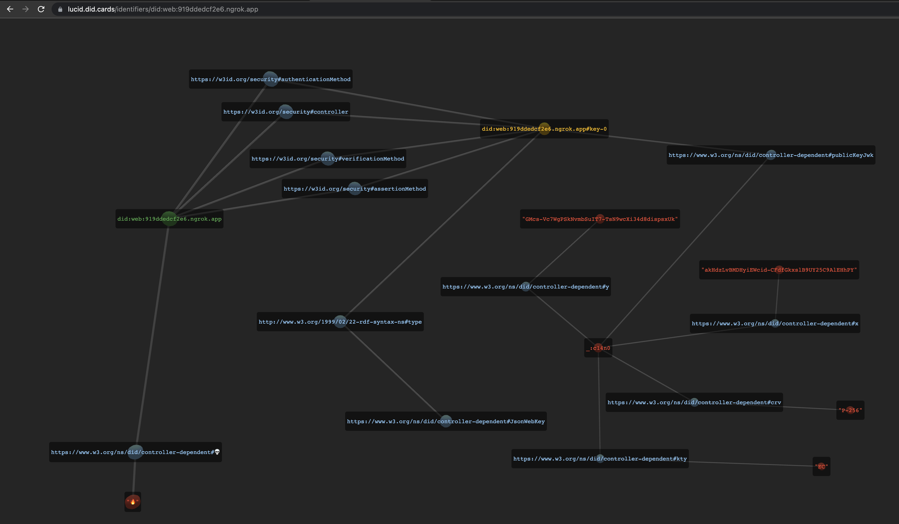

# DID Web Tutorial


#### [Questions? Contact Transmute](https://transmute.typeform.com/to/RshfIw?typeform-source=did-web-tutorial)



#### Create new DID

Generate a new decentralized identifer and new keys.

```sh
./scripts/generate.sh
```

#### Get Current DID

See your current decentralized identifier.

```sh
./scripts/whoami.sh
```

#### Sign with Private Key

Sign a file with openssl.

```sh
echo "🌱 Hello world\!" > ./message.txt
./scripts/sign.sh ./message.txt ./message.txt.signature ./private_key.pem
```

#### Get Public Key from DID URL

Get your public key, from your did document.

```sh
DID=$(cat ./www/.well-known/did.json | jq -r ".id")
./scripts/dereference.sh $DID#key-0 public_key.pem
```

Get a public key, from a DID URL.

```sh
./scripts/dereference.sh did:web:11a6aee842b7.ngrok.app#key-0 public_key.pem
```

#### Verify with Public Key

Verify a file signed with openssl.

```sh
./scripts/verify.sh ./message.txt ./message.txt.signature ./public_key.pem
```


